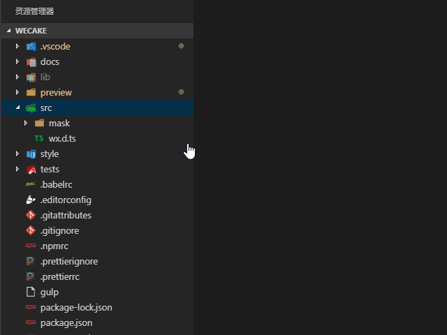
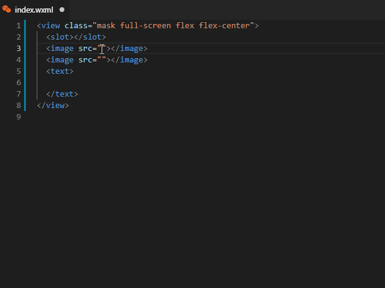
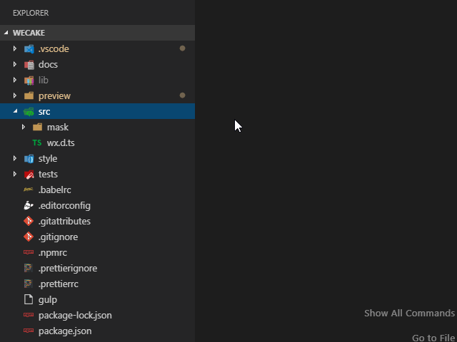
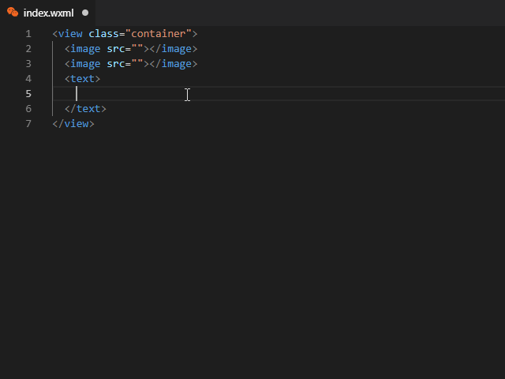

# 小程序助手

VSCODE 微信小程序开发助手

## 功能

- 生成页面/组件
- 页面/组件模板可配置(.js, .wxml, .wxss, .json)
- 文件名及命名风格可配置
- 支持生成 TypeScript
- 插入乱数假文(Lorem), 词库可配置, 字数可输入
- 插入图片 URL, 来源可配置, 尺寸可输入
- 插入用户头像 URL, 来源可配置, 尺寸可输入

## 设置

- `wxapp-helper.namingConvention`: 生成文件命名风格
- `wxapp-helper.page.typescript`: 使用 TS 取代 JS
- `wxapp-helper.page.name`: 页面文件名称(不含后缀)。 设置 null 与文件夹同名
- `wxapp-helper.page.script`: 页面 js/ts 模板。设置 null 不生成
- `wxapp-helper.page.wxml`: 页面 wxml 模板。设置 null 不生成
- `wxapp-helper.page.wxss`: 页面 wxss 模板。设置 null 不生成
- `wxapp-helper.page.json`: 页面 json 模板。设置 null 不生成
- `wxapp-helper.component.typescript`: 使用 TS 取代 JS
- `wxapp-helper.component.name`: 组件文件名称(不含后缀)。 设置 null 与文件夹同名
- `wxapp-helper.component.script`: 组件 js/ts 模板。设置 null 不生成
- `wxapp-helper.component.wxml`: 组件 wxml 模板。设置 null 不生成
- `wxapp-helper.component.wxss`: 组件 wxss 模板。设置 null 不生成
- `wxapp-helper.component.json`: 组件 json 模板。设置 null 不生成
- `wxapp-helper.lorem.count`: 默认插入乱数假文数量
- `wxapp-helper.lorem.characters`: 插入乱数假文字库
- `wxapp-helper.image.src`: 图片来源
- `wxapp-helper.image.width`: 默认图片宽度
- `wxapp-helper.image.height`: 默认图片高度
- `wxapp-helper.avatar.src`: 头像来源
- `wxapp-helper.avatar.size`: 默认头像宽高

> 注：模板配置项可使用`base64`内容。格式如`base64:Q29tcG9uZW50KHsKICBkYXRhOiB7fSwKICBwcm9wZXJ0aWVzOiB7fSwKICBtZXRob2RzOiB7fSwKICBvcHRpb25zOiB7CiAgICBhZGRHbG9iYWxDbGFzczogdHJ1ZQogIH0KfSk=`

示例配置:

```json
{
  "wxapp-helper.namingConvention": "spinalcase",
  "wxapp-helper.component.typescript": true,
  "wxapp-helper.component.name": "index",
  "wxapp-helper.component.json": "{\n  \"component\": true\n}",
  "wxapp-helper.component.wxml": "<view class=\"container\">\n  <slot></slot>\n</view>",
  "wxapp-helper.component.script": "base64:Q29tcG9uZW50KHsKICBkYXRhOiB7fSwKICBwcm9wZXJ0aWVzOiB7fSwKICBtZXRob2RzOiB7fSwKICBvcHRpb25zOiB7CiAgICBhZGRHbG9iYWxDbGFzczogdHJ1ZQogIH0KfSk=",
  "wxapp-helper.component.wxss": ""
}
```

## 截图





# WXAPP Helper

WeChat Mini App Helper for VSCODE

## Features

- Generate page/component files from explorer context menu
- Customizable page/component template(.js/ts, .wxml, .wxss, .json)
- Customizable file names and naming conventions
- Support TypeScript files generating
- Insert Lorem text with customizable word source and word count
- Insert Image URL with customizable source and size
- Insert avatar URL with customizable source and size

## Extension Settings

This extension contributes the following settings:

- `wxapp-helper.namingConvention`: Naming convention for generated files
- `wxapp-helper.page.typescript`: Using TypeScript instead of JavaScript
- `wxapp-helper.page.name`: Page file names without extensions. Set to null to be equal to folder name
- `wxapp-helper.page.script`: Page script template
- `wxapp-helper.page.wxml`: Page wxml template
- `wxapp-helper.page.wxss`: Page wxss template
- `wxapp-helper.page.json`: Page json template
- `wxapp-helper.component.typescript`: Using TypeScript instead of JavaScript
- `wxapp-helper.component.name`: Component file names without extensions. Set to null to be equal to folder name
- `wxapp-helper.component.script`: Component script template
- `wxapp-helper.component.wxml`: Component wxml template
- `wxapp-helper.component.wxss`: Component wxss template
- `wxapp-helper.component.json`: Component json template
- `wxapp-helper.lorem.count`: Default count of characters to generate
- `wxapp-helper.lorem.characters`: Lorem characters
- `wxapp-helper.image.src`: Image source
- `wxapp-helper.image.width`: Default image width
- `wxapp-helper.image.height`: Default image height
- `wxapp-helper.avatar.src`: Avatar source
- `wxapp-helper.avatar.size`: Default avatar width/height

> NOTE：all template configs support `base64` format. e.g. `base64:Q29tcG9uZW50KHsKICBkYXRhOiB7fSwKICBwcm9wZXJ0aWVzOiB7fSwKICBtZXRob2RzOiB7fSwKICBvcHRpb25zOiB7CiAgICBhZGRHbG9iYWxDbGFzczogdHJ1ZQogIH0KfSk=`

e.g.

```json
{
  "wxapp-helper.namingConvention": "spinalcase",
  "wxapp-helper.component.typescript": true,
  "wxapp-helper.component.name": "index",
  "wxapp-helper.component.json": "{\n  \"component\": true\n}",
  "wxapp-helper.component.wxml": "<view class=\"container\">\n  <slot></slot>\n</view>",
  "wxapp-helper.component.script": "base64:Q29tcG9uZW50KHsKICBkYXRhOiB7fSwKICBwcm9wZXJ0aWVzOiB7fSwKICBtZXRob2RzOiB7fSwKICBvcHRpb25zOiB7CiAgICBhZGRHbG9iYWxDbGFzczogdHJ1ZQogIH0KfSk=",
  "wxapp-helper.component.wxss": ""
}
```

## Screenshots





## [Release Notes](CHANGELOG.md)
